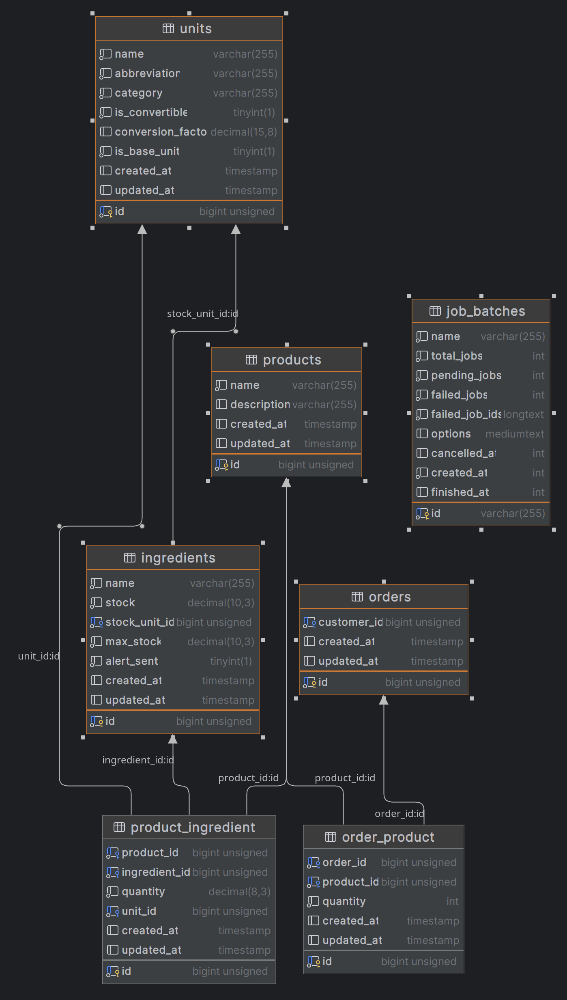

### Foodics Challenge

## Content: 
- [Problem Statement](#problem-statement)
- [How to run the code](#how-to-run-the-code)
- [How to run the tests](#how-to-run-the-tests)
- [Solution](#solution)

## Problem Statement
> we are designing a system that updates ingredient stock levels, and alerts staff when supplies run low, to ensure that we have enough ingredients to make our burgers. The system should also be able to process orders and update the stock levels of ingredients accordingly.

## How to run the code 

- install php version 8
- Set up environment: `cp .env.example .env`
- Install sail dependencies: `composer require laravel/sail --dev`
- Start Sail: `./vendor/bin/sail up`
- Run migrations: `./vendor/bin/sail artisan migrate --seed`
- Start queue worker: `./vendor/bin/sail artisan queue:work`

## How to run the tests
- Run tests: `./vendor/bin/sail artisan test`

## Solution
- We solved this by making an api call that creates an order which have a default status of 'pending', then we send the order to the customer.
- Then we dispatch a batch that contain two jobs, one to update the stock level and the other to send an alert if the stock level is low.
- If we fail to update the stock level we update the order status to 'cancelled' and store the error message in the order ( we can notify the customer via websocket ).

## Database Schema

